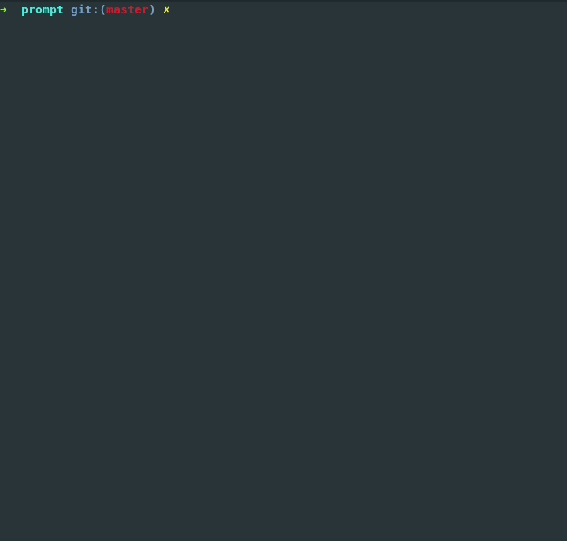

# AaConsole
```
================================================
                 _____ _____
                |  _  |  _  |
                |     |     |
                |__|__|__|__|
   _____ _____ _____ _____ _____ __    _____
  |     |     |   | |   __|     |  |  |   __|
  |   --|  |  | | | |__   |  |  |  |__|   __|
  |_____|_____|_|___|_____|_____|_____|_____|
================================================
```
## What is AaConsole?
Aa_console is a CLI tool that helps with AppArmor management; It simplifies the basic AppArmor operations and adds some custom commands (e.g. `log_search`) </br>

To have a more detailed explanaition of every command and to know how to extends AaConsole features please refer to the [wiki](https://github.com/beard33/aa_console/wiki) </br>

## Requirements
In order to use `aa_console` you need:
* **AppArmor** installed and enabled (please refer to the [official wiki](https://gitlab.com/apparmor/apparmor/wikis/home) for installation)
* **Ruby** installed on your system
* **Auditd** installed and enabled on your system (the `log_search` command relies on this daemon)

## Usage
The main file is the one called `./aa_console.rb` and it **must be run as sudo**. Once the program is running you have just to type `help` to get a command list with description </br>


